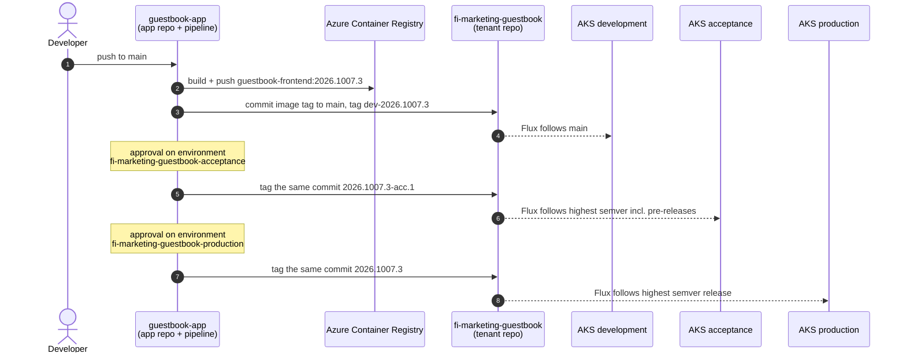
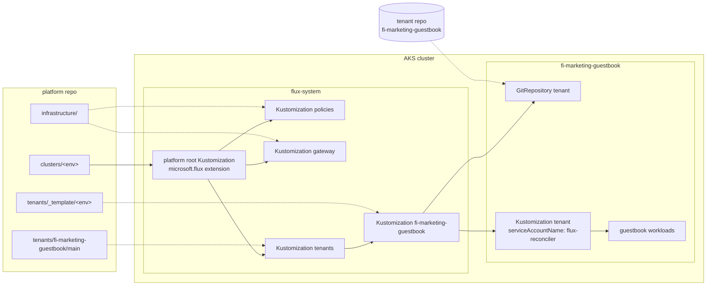

# Multi-tenant application platform on AKS with Flux

A reference structure for a large, multi-tenant, GitOps-based application
platform on Azure Kubernetes Service. Flux deploys everything, and promotion
between environments is done with Git tags, so nothing is rebuilt.

> **One GitHub repository, many Azure DevOps repositories.** Each top-level
> folder stands for its own Git repository in the real setup. All paths and
> URLs in the files are written as they would be in those repositories (for
> example `./clusters/development`, `https://dev.azure.com/contoso/Platform/_git/...`).

| Folder | Real repository | Owner | Purpose |
|---|---|---|---|
| [`platform/`](platform/) | `Platform/platform` | Platform team | AKS infrastructure (Terraform, kept elsewhere for now), cluster-wide Flux config, admission policies, shared Gateway, tenant onboarding |
| [`fi-marketing-guestbook/`](fi-marketing-guestbook/) | `Platform/fi-marketing-guestbook` | Tenant (deploy only) | Kubernetes manifests of one tenant, followed by Flux |
| [`pipeline-templates/`](pipeline-templates/) | `Platform/pipeline-templates` | Platform team | Azure DevOps build and promotion template |
| [`guestbook-app/`](guestbook-app/) | `Marketing/guestbook` | Application team | Application source, Dockerfile and `azure-pipelines.yml` |

## Concepts

### Naming: `<node pool>-<group>-<tenant>[-<instance>]`

| Part | Example | Meaning |
|---|---|---|
| node pool | `fi`, `se`, `be` | Country. Workloads are pinned to that country's nodes |
| group | `marketing` | Organisational unit |
| tenant | `guestbook` | Application or team |
| instance | `dev2` | Optional extra environment in the same cluster |

Examples: `fi-marketing-guestbook`, `fi-marketing-guestbook-dev2`. The same
name is used for the namespace, the tenant repository, the Azure DevOps
environments and the default host name. Kubernetes limits namespace names to
63 characters.

### Tenant instance = namespace

The platform repository onboards **tenant instances**. Each instance is one
namespace, and the platform creates its RBAC, quota, network policies, Pod
Security level and the Flux objects that follow the tenant repository.

- An instance names a tenant repository *and a path in it*, so one repository
  can feed several namespaces. A large application whose components need
  separate namespaces or node pools is one tenant repository with several
  instances, released together.
- Components that should be released independently go in separate tenant
  repositories.
- Extra development environments (`-dev2`) are instances that exist only in
  the development cluster.

### Release channels

| Cluster | Follows in the tenant repository | Example |
|---|---|---|
| development | every commit of `main` | |
| acceptance | highest semver tag **including** pre-releases | `2026.1007.3-acc.1` |
| production | highest semver tag **without** pre-release | `2026.1007.3` |

The channel is a property of the cluster (`environment` in `cluster-vars`), not
of the tenant. More clusters, such as a second production cluster in another
region, can join an existing channel.

Versions are generated from the date and the build run: `yyyy.Mdd.run`. For
example, the third build on 7 October 2026 is `2026.1007.3`. Semver forbids
leading zeros, so 7 January becomes `2026.107.1`.

## How a change flows



Every environment runs **the same tenant repository commit**, identified by
its tag. Only the overlay (`environments/<environment>`) differs.

The approval stages can wait for up to 30 days. To promote an older build
later, run the pipeline manually with `version=2026.1007.3`. That run has no
build stage, only promotion.

### Rollback

Flux always deploys the highest matching tag. To roll back production, an
administrator deletes the bad release tag in the tenant repository, which
needs the *Force push* permission:

```sh
git push origin :refs/tags/2026.1008.1          # production falls back to the previous release
git push origin :refs/tags/2026.1008.1-acc.1    # acceptance as well, if needed
```

Alternatively, roll forward: revert the change in the application, build and
promote it as a new version. The pipeline refuses to promote a version that
is older than what an environment already runs, because Flux would ignore it.

## How the clusters are wired



Tenant isolation uses Kubernetes-native mechanisms only:

- **Flux impersonation.** Tenant manifests are applied as the namespace's
  `flux-reconciler` service account, which is `admin` in that namespace only.
  `targetNamespace` forces every object into it.
- **ValidatingAdmissionPolicies (CEL)**, in [`platform/infrastructure/policies`](platform/infrastructure/policies):
  - Workloads must run on the namespace's node pool. Wildcard tolerations and
    `nodeName` are rejected.
  - Tenant Flux objects must impersonate a service account.
  - Objects the platform creates in tenant namespaces cannot be changed by
    tenants.
  - HTTPRoute host names must belong to the namespace.
- **Pod Security Admission** (`baseline` enforced, `restricted` warned),
  **ResourceQuota/LimitRange** and **NetworkPolicy** (default deny ingress).
- **Gateway API** for ingress, through one shared Gateway per cluster.
  **External Secrets Operator** handles secrets, with Key Vault behind it.

## Repository guides

- [platform/README.md](platform/README.md): structure, onboarding a tenant, adding clusters and node pools, the contract with Terraform
- [fi-marketing-guestbook/README.md](fi-marketing-guestbook/README.md): what a tenant repository contains and the variables it can use
- [pipeline-templates/README.md](pipeline-templates/README.md): using the template (referenced or copied), Azure DevOps setup and permissions
- [guestbook-app/README.md](guestbook-app/README.md): the demo application
